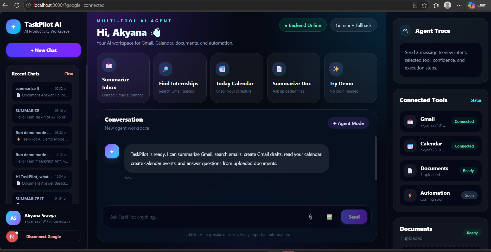
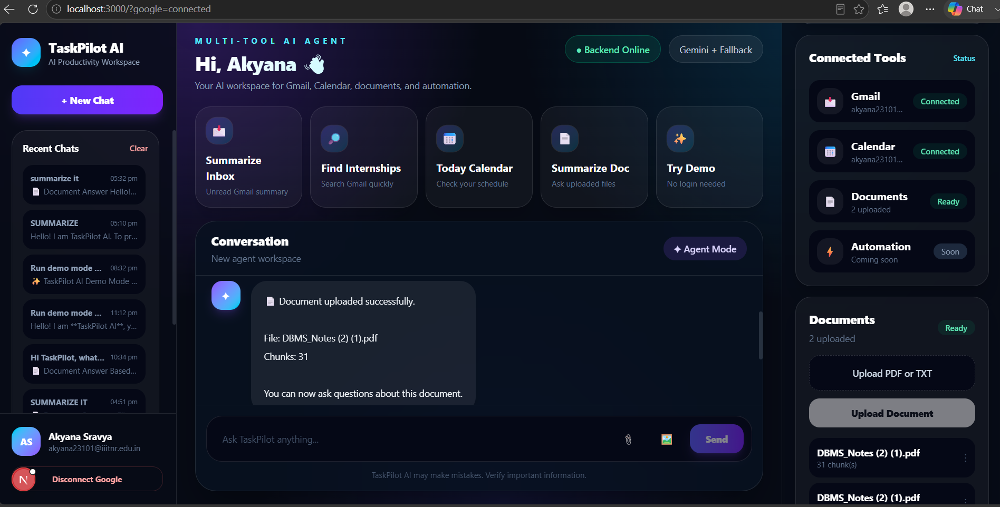
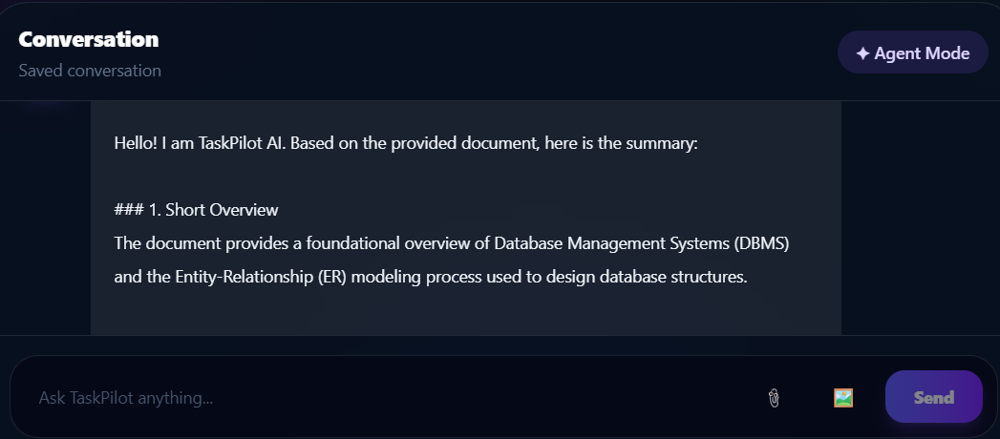
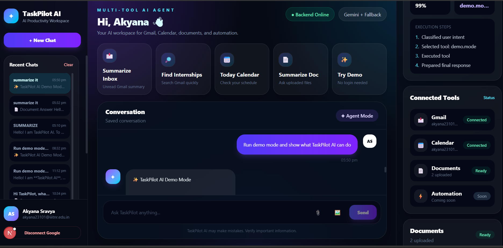
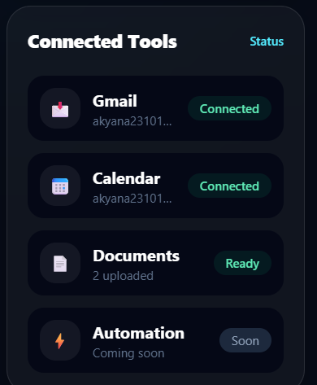

# TaskPilot AI — Multi-Tool AI Productivity Agent

TaskPilot AI is a full-stack AI productivity assistant that connects Gmail, Google Calendar, document intelligence, chat history, and AI agent workflows into one modern SaaS-style workspace.

It uses an agent pipeline with intent classification, tool routing, Gemini-powered responses, document RAG, MongoDB persistence, Google OAuth, and demo mode to help users summarize emails, search Gmail, draft emails, check calendar events, create meetings, upload documents, and ask questions from files.

---

## 🚀 Features

### AI Agent Workflow

- Intent classification for user queries
- Tool routing based on detected intent
- Agent trace showing selected tool, confidence, and execution steps
- Gemini-powered responses with fallback support
- Demo mode for recruiter testing without Google login

### Gmail Assistant

- Google OAuth login
- Gmail connection status
- Summarize unread Gmail messages
- Search emails by topic or sender
- Create Gmail draft responses
- Demo Gmail mode when Google is not connected

### Calendar Assistant

- Query Google Calendar events
- Check today’s meetings
- Create calendar events
- Demo calendar mode when Google is not connected

### Document Intelligence / RAG

- Upload PDF and TXT files
- Extract readable text from documents
- Smart document chunking
- MongoDB-backed document storage
- Hybrid chunk retrieval
- Gemini-grounded document answers
- Document summarization
- Source and chunk references in answers
- Clean PDF upload validation and error handling

### Chat History and Memory

- Persistent chat history
- Recent chats sidebar
- Load previous conversations
- Clear history
- MongoDB conversation storage

### Production-Oriented Features

- MongoDB Atlas integration
- User-specific chats and documents
- Google token storage in MongoDB
- Health check endpoint
- Production CORS setup
- Environment variable configuration
- Clean frontend upload validation
- SaaS-style dashboard UI

---

## 🖼️ Screenshots

### Dashboard and Quick Actions

Main TaskPilot AI workspace showing quick actions such as Summarize Inbox, Find Internships, Today Calendar, Summarize Doc, and Try Demo.



### Document Upload

PDF/TXT upload flow showing successful document processing and chunk creation.



### Document RAG Answer

Document question-answering flow where TaskPilot summarizes uploaded files using Gemini-powered RAG.



### Demo Mode

Demo mode for testing Gmail and Calendar workflows without connecting a real Google account.



### Connected Tools

Connected tools panel showing Gmail, Calendar, Documents, and Automation status.



## 🛠️ Tech Stack

### Frontend

- Next.js
- React
- TypeScript
- Tailwind CSS

### Backend

- Node.js
- Express.js
- TypeScript
- Multer
- Google APIs
- Gemini API

### Database

- MongoDB Atlas
- Mongoose

### AI / RAG

- Gemini API
- Intent classification
- Tool routing
- Document chunk retrieval
- Grounded document answering

### Integrations

- Google OAuth 2.0
- Gmail API
- Google Calendar API

---

## 🧠 Agent Architecture

```txt
User Message
     ↓
Intent Classifier
     ↓
Tool Selector
     ↓
Tool Router
     ↓
Gmail / Calendar / Document / Demo / Gemini
     ↓
Final Response
     ↓
Agent Trace + Chat History
```

Supported intents:

```txt
GENERAL_CHAT
EMAIL_SUMMARY
EMAIL_SEARCH
EMAIL_DRAFT
CALENDAR_QUERY
CALENDAR_CREATE
DOCUMENT_QA
TASK_PLANNING
DEMO_MODE
```

---

## 📁 Project Structure

```txt
TaskPilot-AI
├── backend
│   ├── src
│   │   ├── config
│   │   ├── controllers
│   │   ├── database
│   │   ├── intents
│   │   ├── models
│   │   ├── routes
│   │   ├── services
│   │   ├── tools
│   │   │   ├── calendar
│   │   │   ├── document
│   │   │   └── gmail
│   │   ├── utils
│   │   └── server.ts
│   ├── .env.example
│   └── package.json
│
├── frontend
│   ├── src
│   │   └── app
│   │       └── page.tsx
│   ├── .env.example
│   └── package.json
│
├── assets
│   └── screenshots
│
└── README.md
```

---

## ⚙️ Environment Variables

### Backend `.env`

Create a file:

```txt
backend/.env
```

Add:

```env
PORT=5000

LLM_PROVIDER=gemini
LLM_FALLBACK_PROVIDER=mock

GEMINI_API_KEY=your_gemini_api_key_here
GEMINI_MODEL=gemini-3.1-flash-lite
GEMINI_MAX_OUTPUT_TOKENS=350

MONGODB_URI=your_mongodb_atlas_connection_string_here

GOOGLE_CLIENT_ID=your_google_client_id_here
GOOGLE_CLIENT_SECRET=your_google_client_secret_here
GOOGLE_REDIRECT_URI=http://localhost:5000/api/auth/google/callback

FRONTEND_URL=http://localhost:3000

DEMO_MODE_ENABLED=true
```

### Frontend `.env.local`

Create a file:

```txt
frontend/.env.local
```

Add:

```env
NEXT_PUBLIC_API_URL=http://localhost:5000
```

---

## ▶️ Local Setup

### 1. Clone the repository

```bash
git clone https://github.com/sravyaakyana-prog/TaskPilot-Ai.git
cd TaskPilot-AI
```

### 2. Install backend dependencies

```bash
cd backend
npm install
```

### 3. Install frontend dependencies

```bash
cd ../frontend
npm install
```

### 4. Start backend

```bash
cd ../backend
npm run dev
```

Backend runs on:

```txt
http://localhost:5000
```

Health check:

```txt
http://localhost:5000/api/health
```

### 5. Start frontend

```bash
cd ../frontend
npm run dev
```

Frontend runs on:

```txt
http://localhost:3000
```

---

## 🔗 API Endpoints

### Health

```txt
GET /api/health
```

### Chat

```txt
POST /api/chat
```

Example request:

```json
{
  "message": "Summarize my unread emails today",
  "conversationId": null
}
```

### Google Auth

```txt
GET    /api/auth/google
GET    /api/auth/google/callback
GET    /api/auth/google/status
POST   /api/auth/google/disconnect
DELETE /api/auth/google/disconnect
```

### Documents

```txt
GET  /api/documents
POST /api/documents/upload
```

### Chat History

```txt
GET    /api/history
GET    /api/history/:id
DELETE /api/history
```

---

## 🧪 Demo Mode

TaskPilot AI includes demo mode so recruiters or reviewers can test the product without connecting their personal Gmail or Calendar.

Demo mode supports:

```txt
Run demo mode
Summarize my emails
Find emails about internships
Draft an email for AI/ML internship
What meetings do I have today?
Create a meeting tomorrow at 6 PM
```

Without Google connection:

- Gmail uses sample demo data
- Calendar uses sample demo data
- Document upload still works
- Gemini chat still works

With Google connection:

- Gmail uses real Gmail API
- Calendar uses real Google Calendar API

---

## 📄 Document RAG Flow

```txt
Upload PDF/TXT
     ↓
Extract text
     ↓
Clean text
     ↓
Create smart chunks
     ↓
Store chunks in MongoDB
     ↓
Retrieve relevant chunks
     ↓
Generate grounded answer using Gemini
     ↓
Show sources/chunks
```

Example questions:

```txt
summarize it
what are the key points?
explain process scheduling from this document
what does this document say about threads?
```

---

## 🔐 Google OAuth Flow

```txt
Connect Google
     ↓
Google OAuth Consent
     ↓
Save user profile in MongoDB
     ↓
Store Google tokens in MongoDB
     ↓
Enable Gmail and Calendar tools
```

The app also supports disconnecting Google from the UI.

---

## 🧾 MongoDB Collections

```txt
users
google_token_sessions
chat_conversations
uploaded_documents
```

---

## ✅ Current Status

Completed:

- Full-stack app setup
- Google OAuth
- Gmail tools
- Calendar tools
- MongoDB persistence
- User-specific chats and documents
- Google token storage in MongoDB
- Real Gemini provider
- Gemini fallback safety
- Document upload and RAG
- Demo mode
- Agent trace UI
- Production CORS
- Health check endpoint
- Clean SaaS dashboard UI

Remaining:

- Backend deployment
- Frontend deployment
- Final resume polish

---

## 🚀 Deployment Plan

### Backend

Recommended platform:

```txt
Render
```

Backend needs these environment variables:

```txt
PORT
MONGODB_URI
GEMINI_API_KEY
GEMINI_MODEL
GEMINI_MAX_OUTPUT_TOKENS
GOOGLE_CLIENT_ID
GOOGLE_CLIENT_SECRET
GOOGLE_REDIRECT_URI
FRONTEND_URL
DEMO_MODE_ENABLED
```

### Frontend

Recommended platform:

```txt
Vercel
```

Frontend needs:

```txt
NEXT_PUBLIC_API_URL
```

After deployment:

```env
FRONTEND_URL=https://your-vercel-app.vercel.app
GOOGLE_REDIRECT_URI=https://your-render-backend.onrender.com/api/auth/google/callback
NEXT_PUBLIC_API_URL=https://your-render-backend.onrender.com
```

---

## 🎯 Resume Description

**TaskPilot AI — Multi-Tool AI Productivity Agent**

Built a full-stack AI productivity agent using Next.js, Express.js, TypeScript, MongoDB, Google OAuth, Gmail API, Calendar API, Gemini API, and document RAG. Implemented an agent pipeline with intent classification, tool routing, Gmail summarization, calendar automation, document Q&A, persistent chat history, Google token storage, demo mode, and a production-style SaaS dashboard.

---

## 🏆 Resume Bullet Points

- Built a full-stack AI productivity assistant using Next.js, Express.js, TypeScript, MongoDB, Google OAuth, Gmail API, Calendar API, and Gemini API.
- Implemented an AI agent pipeline with intent classification, tool routing, agent trace, and Gemini-powered responses with fallback handling.
- Developed Gmail tools for unread email summarization, email search, and draft creation using Google APIs.
- Integrated Google Calendar tools for event querying and calendar event creation.
- Built document RAG functionality with PDF/TXT upload, smart chunking, MongoDB storage, hybrid retrieval, Gemini-grounded answers, and source references.
- Added user-specific chat history, document storage, Google token persistence, demo mode, and a polished SaaS-style dashboard UI.

---

## 📌 Future Improvements

- JWT-based multi-user authentication
- Encrypted Google token storage
- Role-based user sessions
- Vector embeddings for document retrieval
- MongoDB Atlas Vector Search
- Rate limiting and request protection
- Test coverage
- Logging and monitoring
- Mobile-responsive improvements

---

## 👩‍💻 Author

**Sravya Akyana**

GitHub: `sravyaakyana-prog`